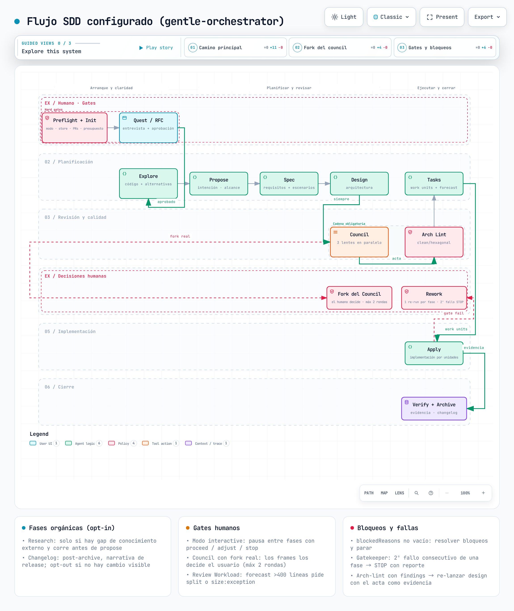

# sdd-own-skills

Repositorio público de la **personalización SDD del usuario** sobre **gentle-ai** (binario de Gentleman-Programming, v2.6.0), bajo el modelo **overlay con bloques gestionados**.

El binario `gentle-ai` instala sus propias skills/commands/prompts (las originales de Alan) en `~/.agents/skills`, `~/.config/opencode/skills` (symlinks), `~/.config/opencode/commands` y `~/.config/opencode/prompts/sdd`. Este repo NO las reemplaza: se adhiere con **skills exclusivas nuestras** (full install) y **overlays** que anexan bloques `<!-- sdd-own:<id>:start --> … <!-- sdd-own:<id>:end -->` al final de los archivos de Alan (strip+append idempotente, nunca pisa el original).

**Modelo de despliegue**: los canónicos de TODO lo nuestro viven en `~/.config/sdd-own/` (`skills/<skill>` originales físicos, `skills/_shared/` bootstrap, `prompts/sdd/`). Los directorios de agentes son SYMLINKS a esos canónicos — `~/.agents/skills/<skill>` (skills exclusivas), `~/.config/opencode/skills/<skill>` y `~/.claude/skills/<skill>` → `~/.config/sdd-own/skills/<skill>` (editar el original se propaga a los tres, sin replicación). **Excepción `_shared`**: `~/.agents/skills/_shared/` es un directorio REAL compartido (base de Alan instalada por `gentle-ai sync` + nuestras copias solo-si-falta); `~/.config/opencode/skills/_shared` y `~/.claude/skills/_shared` symlinkean a ese directorio compartido, NO a sdd-own. `setup.sh` despliega además el servidor MCP local en `~/.config/sdd-own/srv/gh-mcp-server`.

---

## ¿Qué contiene?

### Skills exclusivas (`skills/`)

Cada carpeta es nuestra y se **full-instala**: la copia física ORIGINAL va a `~/.config/sdd-own/skills/<skill>/` y `~/.agents/skills/<skill>/`, `~/.config/opencode/skills/<skill>/` y `~/.claude/skills/<skill>/` son symlinks a esa copia:

| Skill | Rol |
|-------|-----|
| `sdd-quest` | **Fase quest (RFC pre-pass):** entrevista al usuario UNA pregunta a la vez (tope duro de 50), produce un RFC lenguaje-agnóstico que el usuario debe aprobar explícitamente (`Approval: approved`). Corre ANTES del explore. El RFC aprobado es la source of truth. |
| `sdd-architecture-lint` | Segunda mirada independiente del diseño vs clean/hexagonal architecture (solo cuando el diseño toca boundaries). |
| `sdd-changelog` | Narrativa de release + clasificación SemVer automática (post-archive, con opt-out orgánico si no hay cambio visible al consumidor). |
| `skill-sdd-blueprint` | Reference/patrón para crear skills SDD nuevas sin tocar `nextRecommended` ni sobre-ingeniar. |
| `ui-design` | Decisiones de UI (dark luxury / premium), diseño de sistemas, accesibilidad. |
| `web-search` | Búsqueda web con preferencia por MCP dedicados (donsetch, context7). |
| `grilling` | Primitiva de entrevista acotada: UNA pregunta a la vez, tope duro de 50, branch-following. **User-invoked only.** |
| `grill-me` | Alias user-invoked que delega a `grilling`. |
| `hf-cli` | CLI de Hugging Face Hub (`hf`). |
| `typescript` | Patrones estrictos de TypeScript. **Procedencia: Gentleman-Skills (MIT), vendida tal cual.** |
| `tailwind-4` | Patrones de Tailwind CSS 4. **Procedencia: Gentleman-Skills (MIT), vendida tal cual.** |
| `zod-4` | Patrones de Zod 4 (breaking changes vs v3). **Procedencia: Gentleman-Skills (MIT), vendida tal cual.** |
| `playwright` | Patrones de E2E con Playwright (Page Objects, selectors, MCP). **Procedencia: Gentleman-Skills (MIT), vendida tal cual.** |
| `github-pr` | Pull requests de alta calidad con conventional commits y `gh`. **Procedencia: Gentleman-Skills (MIT), vendida tal cual.** |
| `using-git-worktrees` | Aislamiento de workspace vía worktrees: tools nativas primero, fallback `git worktree`, verificación de seguridad. **Procedencia: vendida de [obra/superpowers](https://github.com/obra/superpowers) (MIT, Jesse Vincent); adaptación mínima (frontmatter de suite + nota de provenance).** |
| `test-fixing` | Arreglar tests fallidos agrupando por causa raíz (red → diagnóstico → patch → re-run) hasta suite verde; stack-neutral. **Procedencia: adaptada de [mhattingpete/claude-skills-marketplace](https://github.com/mhattingpete/claude-skills-marketplace) `engineering-workflow-plugin/skills/test-fixing` (Apache-2.0).** |
| `github-automation` | Automatización/operaciones de GitHub vía el MCP oficial (superficie `github_*`): repos, issues, branches, commits, PR review/merge/status (no creación), Actions y code search; cero tokens en la skill. **Authoría propia: sdd-own-skills (fresh reauthoring, repo MIT).** |
| `archify` | Diagramas de arquitectura/workflow/sequence/dataflow/lifecycle como HTML autocontenido (JSON IR tipado → render+validación con Node, sin dependencias). **Procedencia: [tt-a1i/archify](https://github.com/tt-a1i/archify) (MIT), vendida tal cual desde el release asset estable v2.16.0.** |

Las skills vendidas vienen de [Gentleman-Programming/Gentleman-Skills](https://github.com/Gentleman-Programming/Gentleman-Skills) (`curated/`), repo **MIT**; cada `SKILL.md` conserva su frontmatter tal cual (4 con `license: Apache-2.0` declarada, `github-pr` sin campo de licencia — se respeta la licencia del archivo individual). No se renombró contenido ni se alteró el frontmatter.

### Bootstrap de `_shared` (`skills/_shared/`)

- `codegraph.md` — nuestra exclusiva (directrices CodeGraph del repo).
- 8 bootstrap **idénticos a los de Alan**: `README.md`, `engram-convention.md`, `openspec-convention.md`, `persistence-contract.md`, `research-lifecycle.md`, `sdd-orchestrator-sections.md`, `sdd-status-contract.md`, `skill-resolver.md`.

Se instalan **SOLO SI FALTA** (never overwrite): si el archivo ya está instalado — por `gentle-ai sync` o por un sync anterior — no se toca. `~/.agents/skills/_shared/` es un directorio REAL compartido (base de Alan + nuestras copias); `~/.config/opencode/skills/_shared` y `~/.claude/skills/_shared` deben ser symlinks a ese directorio compartido (no a sdd-own), para que los agentes vean la base de Alan + los nuestros.

### Overlays (`overlays/`)

Personalización sobre archivos que instala gentle-ai (las originales de Alan). Cada overlay contiene SOLO bloques `<!-- sdd-own:<id-unico>:start --> … <!-- sdd-own:<id-unico>:end -->`; el sync hace **strip** (quita los bloques con el mismo id ya aplicados) + **append** (anexa el contenido al final del archivo de Alan). NUNCA se sobrescriben líneas del original.

| Overlay | Target | Bloques |
|---------|--------|---------|
| `overlays/skills/sdd-explore/SKILL.md` | `~/.agents/skills/sdd-explore/SKILL.md` | `sdd-explore-quest-validate` — explora VALIDA el RFC aprobado + `## Impact` (impacto regresivo en el mismo pase) |
| `overlays/skills/sdd-onboard/SKILL.md` | `~/.agents/skills/sdd-onboard/SKILL.md` | `sdd-onboard-quest-phase` — el ciclo narrado incluye el quest como Phase 2 |
| `overlays/skills/sdd-propose/SKILL.md` | `~/.agents/skills/sdd-propose/SKILL.md` | `sdd-propose-quest-binding` — proposal consume el quest aprobado como mandato |
| `overlays/skills/sdd-spec/SKILL.md` | `~/.agents/skills/sdd-spec/SKILL.md` | `sdd-spec-rfc-binding` — el spec lee el RFC aprobado como source of truth |
| `overlays/shared/sdd-phase-common.md` | `~/.agents/skills/_shared/sdd-phase-common.md` | `shared-language-domain-contract` (artefactos en inglés / registro neutral) + `shared-quest-explore-contract` (el quest corre antes del explore y es el mandato) |
| `overlays/commands/sdd-new.md` | `~/.config/opencode/commands/sdd-new.md` | `cmd-sdd-new-quest` — el workflow de arranque incluye el quest interview del orquestador |
| `overlays/commands/sdd-continue.md` | `~/.config/opencode/commands/sdd-continue.md` | `cmd-sdd-continue-quest-support` — routing condicional del quest + fases de soporte orgánicas (research / architecture-lint / changelog) |

### Wiring (`wiring/`)

- `wiring/prompts/sdd/orchestrator.md` — contrato del orquestador SDD (referenciado por el fragmento vía `{file:./prompts/sdd/orchestrator.md}`; se edita aquí, no inline en el config global).
- `wiring/prompts/sdd/sdd-rfc-author.md` — prompt del subagente autor del RFC (recibe las Q&A, **no entrevista**).
- `wiring/opencode.sdd.json` — fragmento merge-safe con los agentes SDD (se mergea sobre el config real de opencode; ver sección de merge).

Alan **no gestiona** esos 2 prompts; los prompts de fase de Alan (`sdd-apply.md`, etc.) viven en el mismo directorio y NO se tocan.

---

## Sincronización (`sync-skills.sh`)

El flujo del sync (en orden):

1. **Paso 0 — `gentle-ai sync`**: instala/resetea las bases canónicas de Alan (skills, commands, prompts). Solo en modo real; con `--skip-gentleai-sync` se omite; si el binario no está en PATH, avisa y sigue.
2. **Paso 1 — install de lo nuestro**: skills exclusivas (original en `~/.config/sdd-own/skills/<skill>/` + symlinks en `~/.agents/skills/<skill>/`, `~/.config/opencode/skills/<skill>/` y `~/.claude/skills/<skill>/`), bootstrap de `_shared` (solo si falta: copia a `~/.config/sdd-own/skills/_shared/` y al directorio real compartido `~/.agents/skills/_shared/`, con los `_shared` de opencode/claude como symlinks al compartido), y los prompts propios (`orchestrator.md`, `sdd-rfc-author.md`) a `~/.config/sdd-own/prompts/sdd/` (+ symlink por archivo en `~/.config/opencode/prompts/sdd/` y `~/.claude/prompts/sdd/`).
3. **Paso 2 — overlays**: strip+append de cada `overlays/**` sobre su target de Alan. Si el target no existe → **ERROR** explícito (probablemente `gentle-ai sync` no instaló esa skill; nunca se crea el base).
4. **Paso 3 — merge opencode**: fragmento SDD sobre el config real (detecta `.jsonc` primero, si no `.json`).
5. **Paso 4 — registries**: `--registries <proyecto...>` refresca el skill-registry `.atl/` de cada proyecto (solo modo real).

Es idempotente: el strip+append re-aplica los bloques sin duplicarlos; los bootstrap solo se instalan si faltan; los full-copy de exclusivas solo se escriben si difieren.

```bash
./sync-skills.sh                                  # paso 0 (gentle-ai sync) + install + overlays + merge
./sync-skills.sh --skip-gentleai-sync             # omite gentle-ai sync (ya corrió hace poco)
./sync-skills.sh --check                          # verifica sin modificar (reporta desyncs)
./sync-skills.sh --dry-run                        # ensayo: muestra qué se haría, sin escribir nada
./sync-skills.sh --skip-opencode                  # NO mergea el config de opencode
./sync-skills.sh --registries <p1> <p2> ...       # refresca el registry .atl/ de cada proyecto tras el sync
```

Flags:

- `--check`: solo verifica y reporta (estructura de overlays, targets existentes, marcadores únicos, skills esperadas presentes, desyncs: target sin los bloques esperados, prompts que difieren del repo). No muta nada y **no corre** `gentle-ai sync`. Exit `0` = sincronizado (cero desyncs); `1` = desyncs/faltantes detectados; `2` = errores estructurales/fallos.
- `--dry-run`: muestra `[pendiente]` para cada acción que ejecutaría, sin escribir nada y sin correr `gentle-ai sync`.
- `--skip-gentleai-sync`: omite el paso 0 (útil cuando `gentle-ai sync` ya corrió hace poco).
- `--skip-opencode`: omite el merge del config (el fragmento queda disponible en `wiring/opencode.sdd.json`).
- `--registries <proyecto...>`: acumula directorios de proyectos; tras el sync corre `gentle-ai skill-registry refresh --force` en cada uno (con `--check`/`--dry-run` solo reporta).

Salida (exit code): `0` = sincronizado / verificado sin desyncs (cero desyncs), `1` = desyncs/faltantes detectados (en `--check`), `2` = errores estructurales o fallos al aplicar.

**Semántica de errores**: cualquier condición de conflicto — target de overlay faltante, base no identificable (archivo que solo contiene bloques sdd-own), marcardores rotos o ids de bloque duplicados — produce mensaje claro y exit ≠ 0. NUNCA se clobberea un archivo de Alan: el strip+append solo toca bloques sdd-own, los bootstrap jamás sobrescriben, y los full-copy de exclusivas solo pueden pisar skills de la keep-list (las de Alan no están versionadas aquí).

#### Merge de opencode (fragmento SDD)

El repo versiona **`wiring/opencode.sdd.json`**, un fragmento merge-safe que contiene SOLO los agentes SDD (más `default_agent`). El sync lo mergea sobre el config real de opencode — que puede llamarse `opencode.json` o `opencode.jsonc` (opencode resuelve `.jsonc` primero si ambos existen; el script lo detecta y mergea sobre ese):

- **Añade** los agentes SDD que falten y **actualiza** los existentes (`description`, `mode`, `hidden`, `permission`, `prompt`, `variant`) a la versión canónica del repo.
- **Preserva todo lo personal**: `providers`, `mcp`, `permission`, `models`, `share`, otros agentes y `default_agent` si ya está seteado. Nada se borra; las claves del fragmento ganan solo en las claves SDD.
- **Respaldo único**: antes del primer merge se escribe `<config>.bak` (solo si no existe ya); los merges siguientes no lo sobrescriben. `--skip-opencode` desactiva el paso completo.
- **Prompt del orquestador**: el fragmento usa `"prompt": "{file:./prompts/sdd/orchestrator.md}"`, una referencia al contrato versionado en `wiring/prompts/sdd/orchestrator.md`, que el sync despliega a `~/.config/opencode/prompts/sdd/orchestrator.md`. El contrato se edita en el repo, nunca inline en el JSON global.
- El merge usa `jq` si está disponible; si el config global es JSONC (p. ej. comas finales que opencode tolera) o falta `jq`, usa `python3` con un merge recursivo equivalente.

#### Refresh de registries (`.atl/`)

`./sync-skills.sh --registries <proyecto1> <proyecto2> ...` ejecuta `gentle-ai skill-registry refresh --force` en cada proyecto listado (con el proyecto como cwd) después del sync. Requiere el CLI `gentle-ai` en el PATH; si no está, avisa y omite el paso. El `.atl/` de cada proyecto es local (contiene rutas absolutas) y está gitignoreado. Con `--check`/`--dry-run` solo reporta estado (`[FALTA]` / `[pendiente]`) sin ejecutar nada.

#### Quick-start (clonar el repo)

```bash
git clone https://github.com/AndyTechnologies/sdd-own-skills.git sdd-own-skills
cd sdd-own-skills
./sync-skills.sh            # corre gentle-ai sync (bases de Alan) + install de lo nuestro + overlays + merge SDD
./sync-skills.sh --check    # verifica que todo quedó sincronizado (cero desyncs)
```

Requiere `gentle-ai` (v2.6.0) instalado y en el PATH; si no está, el sync avisa y continúa (los targets de overlay podrían faltar y el paso 2 los reportaría como error).

---

## Setup completo (`setup.sh`)

Wrapper de un solo comando que **delega en `sync-skills.sh`** y, si el sync terminó bien, configura el **MCP de GitHub** en los runtimes detectados. Uso típico en una máquina nueva:

```bash
./setup.sh                            # sync real completo + configurar MCP de GitHub (interactivo)
./setup.sh --skip-gentleai-sync       # omite gentle-ai sync (ya corrió hace poco)
./setup.sh --check                    # verifica sync + estado MCP sin escribir nada
./setup.sh --dry-run                  # ensayo: muestra qué haría, sin escribir nada
./setup.sh --registries <p1> <p2>     # delega --registries al sync (refresh .atl/)
./setup.sh --skip-mcp                 # solo el sync, sin el paso MCP
./setup.sh --force-mcp-token          # en modo real, pedir token aunque exista uno válido
./setup.sh --force                    # sobrescribir config manual MCP sin pedir confirmación
```

**Cómo funciona** (paso 5 del script):

1. **Delegación** (paso 0): corre `sync-skills.sh` con el subconjunto de flags que entiende (`--check`, `--dry-run`, `--skip-gentleai-sync`, `--skip-opencode`, `--registries <proyecto...>`). Los flags propios (`--skip-mcp`, `--force-mcp-token`) nunca se reenvían. Si el sync falla con exit ≥ 2, el paso MCP se omite (gate F9) y `setup.sh` sale con ese mismo código. `--check` y `--dry-run` son mutuamente excluyentes (exit 1 si van juntos).
2. **Detección de runtimes** (5a): las definiciones declarativas viven en `wiring/mcp.d/<runtime>.json`; cada una declara su archivo target, la clave raíz y el bloque a mergear. Runtimes no instalados se reportan como `[aviso]` y se omiten:
   - `opencode` → configuración detectada (`$OPENCODE_CONFIG`, si no `~/.config/opencode/opencode.jsonc`, si no `.json`), clave `mcp`.
   - `pi` → `~/.pi/agent/mcp.json`, clave `mcpServers` (usa `auth: "bearer"` + `bearerTokenEnv`, requisito del adapter).
   - `claude` → `~/.claude.json`, clave `mcpServers`.
   - `codex` → `~/.codex/config.toml`, sección `[mcp_servers.github]`.
3. **Gate de token** (5b, solo modo real): si no hay token, pide un **PAT de GitHub** por prompt oculto (`read -rs`) y lo valida contra `https://api.github.com/user` (seam `SDD_OWN_GH_API`). El token se guarda en **`~/.config/sdd-own/github-mcp.env`** (directorio 0700, archivo 0600, solo el fingerprint enmascarado en el reporte). Con token válido existente, pregunta si mantener o rotar (auto-keep sin TTY; `--force-mcp-token` fuerza la pregunta).
4. **Merges** (5e): aplica el bloque declarado en cada target presente (json-key merge sobre la clave raíz; sección TOML para codex, preservando el resto del archivo). En `--check` los merges pendientes/divergentes se reportan (`[pendiente]` / `[aviso]`) sin tocar nada; en modo real se aplican y se reportan `[actualizado]` / `[up-to-date]`.

**Excepción sancionada** (F7): `setup.sh` es el ÚNICO escritor permitido de la clave `mcp` en la config real de opencode fuera del pipeline de sync. El fragmento `wiring/opencode.sdd.json` nunca contiene `mcp`; los agentes SDD se siguen gestionando por sync (paso 3) y el MCP de GitHub por `setup.sh`, sin pisarse.

**Exportar el token a los runtimes** (claude/codex leen `GITHUB_PERSONAL_ACCESS_TOKEN` de la env):

```bash
set -a; source ~/.config/sdd-own/github-mcp.env; set +a
```

**Variante Docker** (sin token en disco): `MCP_GITHUB_TRANSPORT=docker ./setup.sh` usa el contenedor oficial (`ghcr.io/github/github-mcp-server`) con `--env-file`, y los bloques por runtime apuntan al binario docker en vez del endpoint remoto. Requiere `docker` en el PATH.

**Semántica de salida**: `0` = todo bien; `1` = estructura/conflicto (flags excluyentes, modo real sin TTY con token necesario, o token inválido/rechazado en check); `2` = fallo estructural (sync falló). La red/API inalcanzable **no** es estructural: degrada con `[aviso]` y exit 0 (modo real y `--check`, T09/T20). En `--check`, un MCP no configurado con token ausente es **estado limpio válido** (exit 0); solo los rechazos del API (401/403) marcan token drift (exit 1).

**Seams de test** (no tocar en producción): `MCP_DEBUG_SYNC_ARGS=<file>` (escribe `exit=<n>` + argv de la delegación; `MCP_DEBUG_SYNC_ARGS_EXIT` simula el exit del sync), `SDD_OWN_GH_API` (base URL de la API), `SDD_OWN_DEBUG_CURL_CONFIG=<path>` (dump del config temporal de curl — **contiene el token**, solo diagnóstico y borra el dump después), `MCP_GITHUB_TRANSPORT`.

---

## Nuestra personalización del pipeline SDD

El pipeline canónico de Alan (instalado por `gentle-ai sync`) se extendió con bloques `sdd-own` anexados por overlays. Los cambios principales:

### 0. El flujo completo de un vistazo



Diagrama del pipeline SDD que configura este repo (generado con nuestra skill `archify`, quality `showcase`). Muestra el camino principal — `Preflight + Init` → `Quest/RFC` → `Explore` → `Propose` → `Spec` → `Design` → `Council` (3 lentes en paralelo, siempre) → `Arch Lint` (con el acta obligatoria) → `Tasks` → `Apply` → `Verify + Archive` — más la lane de decisiones humanas (fork real del council, rework por gate fail) y las cards con fases orgánicas, gates humanos y bloqueos.

- **HTML interactivo**: [`docs/diagrams/sdd-flow.html`](docs/diagrams/sdd-flow.html) (autocontenido, ábrelo en el navegador; incluye 3 vistas guiadas).
- **Fuente editable**: [`docs/diagrams/sdd-flow.workflow.json`](docs/diagrams/sdd-flow.workflow.json) (JSON IR schema v2; editar y re-renderizar/validar con la skill `archify`).

### 1. El RFC aprobado es la source of truth (`sdd-quest` v3.1 → exclusiva)

- **`sdd-quest` corre ANTES del explore** (es una skill exclusiva nuestra). Entrevista al usuario una pregunta a la vez (tope duro de 50), produce un RFC lenguaje-agnóstico y exige **aprobación explícita del usuario** (`Approval: approved`).
- **Nunca se auto-aprueba una decisión** en nombre del usuario: el quest es el *confirmed pre-proposal handoff* (non-goal de #3332).
- **El orquestador** (único rol con canal interactivo `question`) realiza la entrevista; el subagente `sdd-rfc-author` solo **redacta** el RFC canónico a partir de las Q&A recolectadas — no entrevista.

### 2. El quest alimenta explore / propose / spec (overlays de skills)

- **`sdd-explore`** (bloque `sdd-explore-quest-validate`): VALIDA el RFC aprobado contra el código real — "¿se puede buildear esto aquí?" — y mapea el **impacto regresivo** (`## Impact`) en el mismo pase, con opt-out orgánico para cambios greenfield/aditivos.
- **`sdd-propose`** (bloque `sdd-propose-quest-binding`): consume el quest aprobado + la exploración; no entrevista.
- **`sdd-spec`** (bloque `sdd-spec-rfc-binding`): lee el **RFC aprobado como input vinculante** (goals, contracts, invariants, acceptance criteria → escenarios).

### 3. Quest y fases de soporte orgánicas (contrato del orquestador)

Sin tocar `nextRecommended`, los hooks orgánicos viven en la sección **`Organic Support Phase Hooks`** del contrato del orquestador (`wiring/prompts/sdd/orchestrator.md`), que es la autoridad en TODA ruta de entrada (command, lenguaje natural, `/sdd-ff`, modo auto). Los commands `/sdd-new`, `/sdd-continue` (bloque `cmd-sdd-continue-quest-support`) y `/sdd-ff` (bloque `cmd-sdd-ff-quest-support`) refuerzan esas reglas y enrutan por **estado de artefactos**:

- **`QUEST-CONDITIONAL`**: en `/sdd-new` el quest **siempre** corre; en `/sdd-continue` es **condicional** — se salta si ya existe un quest `approved` de una corrida previa (evita re-entrevistas redundantes).
- **`sdd-changelog`** — narrativa de release + clasificación SemVer tras `archive` (con opt-out automático si no hay cambio visible al consumidor).
- **`sdd-architecture-lint`** — segunda mirada independiente del diseño vs clean/hexagonal (solo cuando el diseño toca boundaries).
- **`sdd-research`** — evidencia externa auditada antes de `propose`.
- **`skill-sdd-blueprint`** — patrón de referencia para añadir nuevas skills SDD sin romper el flujo.

### 4. Contratos transversales (`sdd-phase-common.md`)

Dos bloques anexados al `_shared/sdd-phase-common.md` de Alan: **Language Domain Contract** (artefactos en inglés, registro neutral) y **Quest↔Explore contract** (el quest corre antes del explore y es el mandato; explore lee SIEMPRE el artefacto completo y si el RFC no es implementable lo devuelve a `needs-changes`).

---

## Estructura

```
sdd-own-skills/
├── LICENSE
├── README.md
├── AGENTS.md                       # guía para agentes de código que trabajan en este repo
├── sync-skills.sh                  # gentle-ai sync + install exclusivas + overlays + merge SDD + registries
├── setup.sh                        # wrapper de sync + paso MCP de GitHub (wiring/mcp.d)
├── skills/
│   ├── <skill>/SKILL.md            # SOLO nuestras exclusivas (full install)
│   └── _shared/                    # codegraph.md + 8 bootstrap idénticos a los de Alan (solo si falta)
├── overlays/
│   ├── skills/<skill>/SKILL.md     # bloques sdd-own sobre skills de Alan
│   ├── shared/<f>.md               # bloques sdd-own sobre _shared de Alan
│   └── commands/<f>.md             # bloques sdd-own sobre commands de Alan
├── wiring/
│   ├── opencode.sdd.json           # fragmento merge-safe: agentes SDD para opencode
│   ├── mcp.d/                      # definiciones declarativas MCP por runtime (opencode/pi/claude/codex)
│   └── prompts/sdd/                # orchestrator.md + sdd-rfc-author.md (nuestros)
├── engram-snapshot/                # artifacts de Engram (diseño/implementación del quest gate)
├── docs/                           # issue-3332-rfc-gate.md, diagrams/ (flujo SDD: PNG + HTML + JSON IR)
└── .gitignore                      # ignora .atl/ (registry con rutas absolutas locales)
```

---

## Licencia

**Este repositorio** está bajo **MIT** (ver [`LICENSE`](LICENSE)) — cubre la colección, la sincronización (`sync-skills.sh`), el setup (`setup.sh` + `wiring/mcp.d`), el wiring, las skills propias (`sdd-quest`, `sdd-changelog`, `sdd-architecture-lint`, `skill-sdd-blueprint`, `ui-design`, `web-search`, `github-automation` — fresh reauthoring) y los overlays.

**Proveniencia de las skills vendidas**: `typescript`, `tailwind-4`, `zod-4`, `playwright` y `github-pr` provienen de [Gentleman-Programming/Gentleman-Skills](https://github.com/Gentleman-Programming/Gentleman-Skills) (`curated/`, repo **MIT**), descargadas tal cual con su frontmatter original (las 4 primeras declaran `license: Apache-2.0`; `github-pr` no declara). Cada skill conserva la licencia de su archivo individual según su autor upstream.

**Proveniencia de las skills adaptadas**: 

- `using-git-worktrees` viene de [obra/superpowers](https://github.com/obra/superpowers) (`tools/git/worktrees/SKILL.md`, **MIT**, Copyright 2025 Jesse Vincent); se adaptó solo el frontmatter (suite `sdd-own-skills` + metadata original + nota de provenance) sin tocar el contenido.
- `test-fixing` viene de [mhattingpete/claude-skills-marketplace](https://github.com/mhattingpete/claude-skills-marketplace) `engineering-workflow-plugin/skills/test-fixing` (**Apache-2.0**); se adaptó para ser stack-neutral conservando la estructura de diagnóstico.
- `github-automation` es de autoría propia (fresh reauthoring) y no deriva de ninguna fuente externa.
- `archify` viene de [tt-a1i/archify](https://github.com/tt-a1i/archify) (**MIT**); se vendió el paquete estable tal cual (release asset `archify.zip` v2.16.0, ver `skills/archify/README.md` y `skill-release.json`). Runtime sin dependencias externas (Node builtins).

**Skills de Alan no versionadas aquí**: las demás skills del ecosistema (`sdd-apply`, `sdd-verify`, `branch-pr`, `go-testing`, etc.) las instala `gentle-ai sync` desde sus fuentes canónicas; este repo solo las personaliza vía overlays. Se respeta la licencia declarada en cada una según su autor upstream.